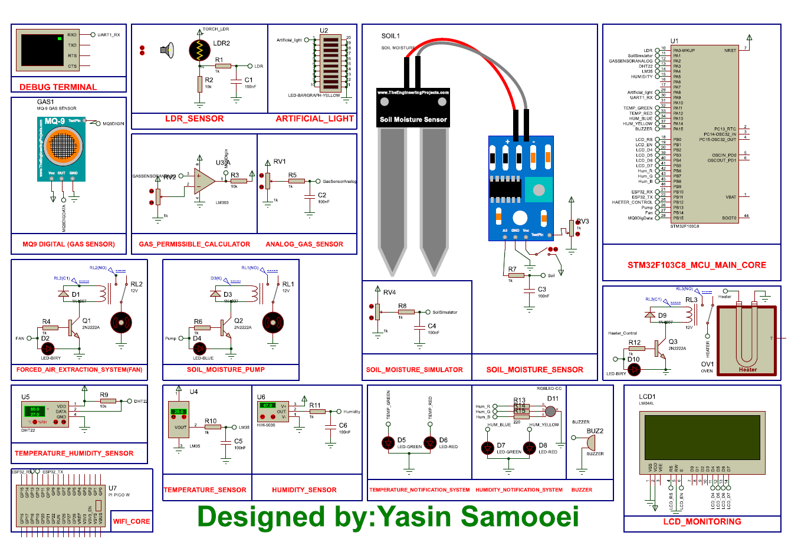
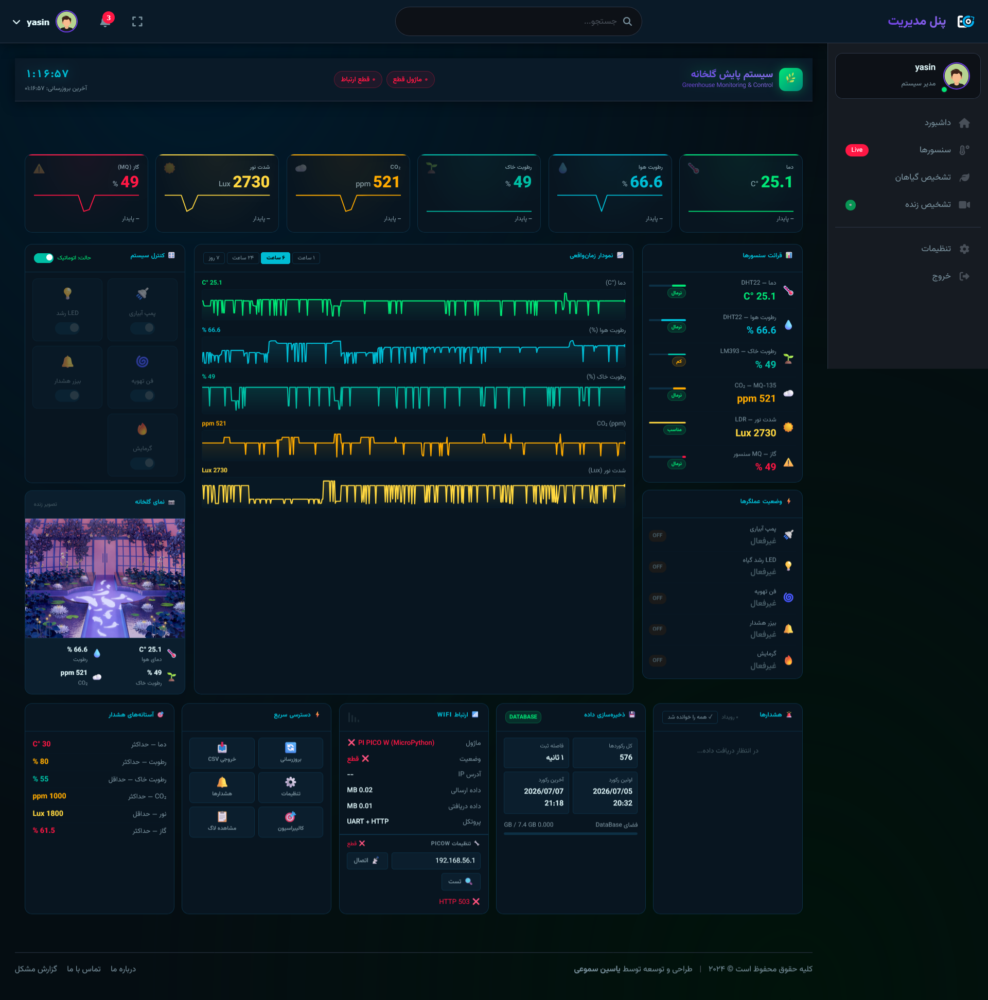

# 🌿 Smart Greenhouse Management System

## An Integrated AI-Powered Platform for Modern Agriculture

<div align="center">
  
  
  
  
  
  
  
</div>

---

## 📋 Table of Contents

1. [Project Overview](#-project-overview)
2. [System Architecture](#️-system-architecture)
3. [Hardware Components](#-hardware-components)
4. [Software Stack](#-software-stack)
5. [Features](#-features)
6. [Installation Guide](#-installation-guide)
7. [Project Structure](#-project-structure)
8. [Hardware Setup](#-hardware-setup)
9. [API Documentation](#-api-documentation)
10. [UI/UX Design](#-ux-design)
11. [Simulation & Schematics](#-simulation--schematics)
12. [Future Roadmap](#-future-roadmap)
13. [Contributing](#-contributing)
14. [License](#-license)
15. [Acknowledgments](#-acknowledgments)

---

## 🌟 Project Overview

> **️ IMPORTANT: This project is currently in its early development stages (v0.1.0). It serves as a basic foundation and learning resource for those interested in smart agriculture systems. The codebase is continuously evolving, and many advanced features are planned for future releases.**

### What is Smart Greenhouse Management System?

The **Smart Greenhouse Management System** is a comprehensive, end-to-end solution designed to revolutionize modern agriculture through the integration of:

- 🔬 **IoT Hardware** (STM32F103C8 + Raspberry Pi Pico W (need Proteus Pro 9.1 SP2))
- 🤖 **Artificial Intelligence** (Deep Learning for Plant Disease Detection)
- 🌐 **Web Dashboard** (Django-based Management Panel)
- 📊 **Real-time Monitoring** (Sensors & Actuators Control)
- 🎯 **Computer Vision** (Live Detection & Classification)

### Project Motivation

This project was born from a simple observation: **agriculture needs technology**, and technology needs to be accessible. As a developer passionate about both software and hardware, I created this system to:

1. **Bridge the gap** between traditional farming and modern technology
2. **Provide a learning platform** for students and developers interested in IoT + AI
3. **Demonstrate** how affordable microcontrollers can power smart agriculture
4. **Create a foundation** that others can build upon and improve

### Current Status

```
╔══════════════════════════════════════════════════════════════════╗
║                    PROJECT STATUS SUMMARY                        ║
╠══════════════════════════════════════════════════════════════════╣
║  Phase        : Alpha Development                                ║
║  Version      : 0.1.0                                            ║
║  Completion   : 35%                                              ║
║  Status       : Active Development                               ║
║  Last Updated : July 2026 (Tir 1405)                             ║
╚══════════════════════════════════════════════════════════════════╝

┌──────────────────────────────────────────────────────────────────┐
│                    FEATURES STATUS                               │
├──────────────────────────────────────────────────────────────────┤
│  Hardware Integration     ████████████████████░░░░  ✅ 100%     │
│  Sensor Reading           ████████████████████░░░░  ✅ 100%     │
│  Actuator Control         ████████████████████░░░░  ✅ 100%     │
│  Dashboard UI             ████████████████░░░░░░░░  🔄 75%      │
│  Plant Detection          ██████████████░░░░░░░░░░  🔄 70%      │
│  Live Streaming           ████████████░░░░░░░░░░░░  🔄 60%      │
│  Mobile App               ████░░░░░░░░░░░░░░░░░░░░  ⏳ 0%       │
│  Weather Forecast         ████░░░░░░░░░░░░░░░░░░░░  ⏳ 0%       │
│  Automated Irrigation     ██████████░░░░░░░░░░░░░░  🔄 50%      │
│  Report Generation        ████░░░░░░░░░░░░░░░░░░░░  ⏳ 0%       │
└──────────────────────────────────────────────────────────────────┘
```

---

## ️ System Architecture

### High-Level Architecture Diagram

```
┌─────────────────────────────────────────────────────────────────────────────┐
│                        SMART GREENHOUSE SYSTEM                              │
├─────────────────────────────────────────────────────────────────────────────┤
│                                                                             │
│  ┌────────────────┐    ┌────────────────┐    ┌────────────────────────┐   │
│  │   HARDWARE     │    │   COMMUNICATION│    │      SOFTWARE           │   │
│  │    LAYER       │    │     LAYER      │    │       LAYER             │   │
│  ├────────────────┤    ├────────────────┤    ├────────────────────────┤   │
│  │                │    │                │    │                        │   │
│  │  Sensors:      │    │  STM32 → UART  │    │  Django Backend        │   │
│  │  - LM35        │────│  → Pico W      │────│  - Models              │   │
│  │  - MQ-9        │    │  → WiFi        │    │  - Views               │   │
│  │  - LDR         │    │  → Django API  │    │  - Serializers         │   │
│  │  - Soil Sensor │    │                │    │  - WebSockets          │   │
│  │  - Humidity    │    │  Communication │    │                        │   │
│  │                │    │  Protocols:    │    │  AI Models:           │   │
│  │  Actuators:    │    │  - UART        │    │  - CNN (PyTorch)       │   │
│  │  - Pump        │    │  - MQTT        │    │  - OpenCV              │   │
│  │  - Fan         │    │  - HTTP/REST   │    │  - YOLO (Planned)      │   │
│  │  - Heater      │    │  - WebSocket   │    │                        │   │
│  │  - LED         │    │                │    │  Dashboard:            │   │
│  │  - Buzzer      │    │  Database:     │    │  - HTML/CSS/JS         │   │
│  │                │    │  - PostgreSQL  │    │  - Responsive UI       │   │
│  │  Camera:       │    │                │    │  - Charts/Graphs       │   │
│  │  - Webcam      │    │                │    │                        │   │
│  └────────────────    └────────────────┘    └────────────────────────┘   │
│                                                                             │
│  ┌─────────────────────────────────────────────────────────────────────┐   │
│  │                     USER INTERFACE                                  │   │
│  ├─────────────────────────────────────────────────────────────────────┤   │
│  │  • Web Dashboard (Desktop/Tablet/Mobile)                          │   │
│  │  • Real-time Sensor Data Visualization                            │   │
│  │  • Plant Disease Detection Interface                              │   │
│  │  • Live Video Streaming                                           │   │
│  │  • Historical Data & Reports                                      │   │
│  └─────────────────────────────────────────────────────────────────────┘   │
─────────────────────────────────────────────────────────────────────────────┘
```

### Data Flow Diagram

```
┌─────────────────────────────────────────────────────────────────────────────┐
│                           DATA FLOW SEQUENCE                                │
├─────────────────────────────────────────────────────────────────────────────┤
│                                                                             │
│  1. Sensors → STM32 (Read Analog/Digital Signals)                           │
│     ┌──────────────────────────────────────────────────────────┐            │
│     │  LM35 (Temp)       →  PA4   (Analog ADC)                │             │
│     │  Humidity Sensor   →  PA5   (Analog ADC)                │             │
│     │  MQ-9 (Gas)        →  PA2   (Analog ADC)                │             │
│     │  LDR (Light)       →  PA0   (Analog ADC)                │             │
│     │  Soil Simulator    →  PA1   (Analog ADC)                │             │
│     │  MQ-9 Digital      →  PB15  (Digital Input)             │             │
│     │  DHT22             →  PA3   (Digital) [DISABLED]        │             │
│     └──────────────────────────────────────────────────────────┘            │
│                                    ↓                                        │
│  2. STM32 → Raspberry Pi Pico W (UART Communication)                        │
│     ┌──────────────────────────────────────────────────────────┐            │
│     │  Data Format: "T:25.5,H:65.2,S:45,G:142,L:560\n"       │              │
│     │  Baud Rate: 115200                                       │            │
│     └──────────────────────────────────────────────────────────┘            │
│                                    ↓                                        │
│  3. Pico W → Django Backend (WiFi / HTTP Request)                           │
│     ┌──────────────────────────────────────────────────────────┐            │
│     │  POST /api/sensors/                                      │            │
│     │  Content-Type: application/json                          │            │
│     └──────────────────────────────────────────────────────────┘            │
│                                    ↓                                        │
│  4. Django → Database (Store Sensor Data)                                   │
│     ┌──────────────────────────────────────────────────────────┐            │
│     │  Table: sensor_data                                      │            │
│     │  - temperature, humidity, soil, gas, ldr                 │            │
│     │  - fan, pump, heater, alarm, light                       │            │
│     │  - created_at                                            │            │
│     └──────────────────────────────────────────────────────────┘            │
│                                    ↓                                        │
│  5. Django → Dashboard (Real-time Visualization)                            │
│     ┌──────────────────────────────────────────────────────────┐            │
│     │  - Charts & Graphs                                       │            │
│     │  - Status Indicators                                     │            │
│     │  - Control Panels                                        │            │
│     └──────────────────────────────────────────────────────────┘            │
│                                    ↓                                        │
│  6. User → Django (Send Commands to Actuators)                              │
│     ┌──────────────────────────────────────────────────────────┐            │
│     │  POST api/send-command/                                  │            │
│     │  {"actuator": "pump", "state": true}                     │            │
│     └──────────────────────────────────────────────────────────┘            │
│                                    ↓                                        │
│  7. Django → Pico W (Control Signals)                                       │
│     ┌──────────────────────────────────────────────────────────┐            │
│     │  HTTP Request to Pico W                                  │            │
│     │  Command: "P=1" or "P=0"                                 │            │
│     └──────────────────────────────────────────────────────────┘            │
│                                    ↓                                        │
│  8. Pico W → STM32 (Actuator Commands)                                      │  
│     ┌──────────────────────────────────────────────────────────┐            │
│     │  UART Signal to STM32                                    │            │
│     │  Control GPIO Pins for Relays                            │            │
│     └──────────────────────────────────────────────────────────┘            │
└─────────────────────────────────────────────────────────────────────────────┘
```

---

## 🔧 Hardware Components

### Microcontrollers

| Component | Model | Role | Specifications |
|-----------|-------|------|----------------|
| Main Controller | STM32F103C8 (Blue Pill) | Sensor Reading & Actuator Control | ARM Cortex-M3, 72MHz, 20KB RAM, 64KB Flash |
| Communication | Raspberry Pi Pico W | WiFi & Data Processing | RP2040, Dual-core ARM Cortex-M0+, WiFi 2.4GHz, MicroPython |

### Sensors

| Sensor | Model | Type | Pin | Measurement | Status |
|--------|-------|------|-----|-------------|--------|
| Temperature | LM35 | Analog | PA0 (ADC) | -55°C to 150°C (10mV/°C) | ✅ Active |
| Humidity | Capacitive Humidity Sensor | Analog | PA5 (ADC) | 0-100% RH | ✅ Active |
| Gas Detection | MQ-9 | Analog/Digital | PA2 (ADC) / PB15 | CO, LPG, Methane (100-1000 ppm) | ✅ Active |
| Light Intensity | LDR (Photoresistor) | Analog | PA0 (ADC) | 0-1000 Lux (approximate) | ✅ Active |
| Soil Moisture | Soil Moisture Simulator | Analog | PA1 (ADC) | 0-100% (capacitive) | ✅ Active |
| Temperature & Humidity | DHT22 | Digital | PA3 | -40°C to 80°C, 0-100% RH | ⚠️ Disabled |

> **Note:** DHT22 sensor is physically connected to PA3 but currently **disabled in the code**. The system uses LM35 for temperature and a separate capacitive humidity sensor instead.

### Actuators

| Actuator | Type | Control Pin | Purpose |
|----------|------|-------------|---------|
| Water Pump | DC Motor | PB13 (Relay) | Irrigation Control |
| Ventilation Fan | DC Motor | PB14 (Relay) | Temperature/Humidity Control |
| Heater | Electric Heater | PB12 (Relay) | Temperature Control |
| Artificial Light | LED Grow Light | PA8 (Relay/PWM) | Photosynthesis Support |

### Indicators & Alerts

| Component | Type | Pin | Purpose |
|-----------|------|-----|---------|
| Buzzer | Active Buzzer | PA15 | Audio Alerts |
| Temperature LED (Green) | LED | PA11 | Normal Temperature Indicator |
| Temperature LED (Red) | LED | PA12 | High Temperature Warning |
| Humidity LED (Blue) | LED | PA13 | Humidity Status |
| Humidity LED (Yellow) | LED | PA14 | Humidity Warning |

### Display

| Component | Interface | Pins | Purpose |
|-----------|-----------|------|---------|
| LCD 16x2 | 4-bit Mode | PB0 (RS), PB1 (EN), PB2-PB5 (D4-D7) | Local Sensor Display |

### Camera Module

- **Type:** USB Webcam (or Raspberry Pi Camera Module)
- **Resolution:** 640x480 (adjustable)
- **Purpose:** Live Plant Detection & Monitoring

---

## 💻 Software Stack

### Backend Technologies

```
Framework:
  - Django 4.2.7 (Python 3.10+)
  - Django REST Framework 3.14.0
  
Database:
  - PostgreSQL 15 (Production)
  - SQLite3 (Development)
  
AI/ML:
  - PyTorch 2.0.0
  - TorchVision 0.15.0
  - OpenCV 4.8.0
  - NumPy 1.24.0
  
Communication:
  - Channels 4.0.0 (WebSocket)
  - MQTT Client (Planned)
  - AsyncIO (Planned)
  
Authentication:
  - Django Authentication
  - JWT (Planned)

Simulation:
  - Proteus Pro 9.1 SP2 Build 42460
```

### Frontend Technologies

```
Core:
  - HTML5
  - CSS3 (Custom Design System)
  - JavaScript (ES6+)
  
Frameworks:
  - jQuery 3.6.0
  - Font Awesome 6.5.0 (Icons)
  
Charts & Visualization:
  - Chart.js (Planned)
  - D3.js (Planned)
  - Custom SVG Charts
  
Styling:
  - Custom Dark Theme
  - Responsive Design
  - CSS Variables (Theming)
```

### Firmware

```
STM32:
  - Language: C/C++
  - IDE: STM32CubeIDE
  - HAL Libraries
  - CubeMX Configuration
  
Raspberry Pi Pico W:
  - Language: MicroPython
  - IDE: Thonny / VS Code
  - Libraries: machine, time, network, urequests
```

---

## ✨ Features

### ✅ Currently Implemented

#### 1. Hardware Integration
- ✅ STM32F103C8 with all sensors (LM35, MQ-9, LDR, Soil Simulator, Humidity)
- ✅ UART communication with Pico W
- ✅ Real-time sensor data reading (ADC & Digital)
- ✅ Actuator control (Pump, Fan, Heater, Artificial Light)
- ✅ LED indicators and Buzzer alerts
- ✅ LCD 16x2 display integration
- ✅ Multi-sensor data aggregation

#### 2. Dashboard Interface
- ✅ Custom dark theme UI
- ✅ Real-time sensor data display
- ✅ Interactive control panels
- ✅ Responsive design for all devices
- ✅ System status indicators
- ✅ Alert/Notification system

#### 3. Plant Disease Detection
- ✅ CNN Model (38 Plant Species)
- ✅ Image upload & analysis
- ✅ Disease classification
- ✅ Accuracy scoring
- ✅ Detection history

#### 4. Live Detection
- ✅ Real-time webcam streaming
- ✅ AI-based frame analysis
- ✅ Live plant identification
- ✅ Disease detection on video
- ✅ Screenshot functionality

#### 5. Data Management
- ✅ PostgreSQL database integration
- ✅ Historical data storage
- ✅ Plant detection logging
- ✅ Sensor data archiving

### 🚧 In Development

#### 1. Mobile Application
- 🚧 React Native (Planned)
- 🚧 Push notifications
- 🚧 Remote control

#### 2. Advanced AI Features
- 🚧 YOLO integration for object detection
-  Segmentation for plant health analysis
-  Multi-class disease detection

#### 3. Automation
- 🚧 Auto-irrigation based on soil moisture
- 🚧 Auto-ventilation based on temperature
- 🚧 Lighting schedule optimization

#### 4. Reporting
- 🚧 PDF report generation
- 🚧 Export to CSV/Excel
- 🚧 Email notifications

---

## 📥 Installation Guide

### Prerequisites

```
System Requirements:
- Python 3.10 or higher
- Git
- Virtual Environment (recommended)
```

### Step 1: Clone the Repository

```bash
git clone https://github.com/YasinSamooei/SmartGreenhouse.git
cd SmartGreenhouse/Dashboard
```

### Step 2: Create Virtual Environment

```bash
# Windows
python -m venv venv
venv\Scripts\activate

# Linux/Mac
python3 -m venv venv
source venv/bin/activate
```

### Step 3: Install Dependencies

```bash
pip install -r requirements.txt
```

### Step 4: Configure Database

```python
# core/settings.py
DATABASES = {
    'default': {
        'ENGINE': 'django.db.backends.postgresql',
        'NAME': 'greenhouse_db',
        'USER': 'greenhouse_user',
        'PASSWORD': 'your_password',
        'HOST': 'localhost',
        'PORT': '5432',
    }
}
```

### Step 5: Apply Migrations

```bash
python manage.py makemigrations
python manage.py migrate
```

### Step 6: Create Superuser

```bash
python manage.py createsuperuser
```

### Step 7: Collect Static Files

```bash
python manage.py collectstatic
```

### Step 8: Run Development Server

```bash
python manage.py runserver 0.0.0.0:8000
```

### Step 9: Access the Application

```
Web Interface: http://localhost:8000
Admin Panel: http://localhost:8000/admin
Dashboard: http://localhost:8000/dashboard
Live Detection: http://localhost:8000/plant/live-detection/
```

---

## 📁 Project Structure

```
SmartGreenhouse/
├── Dashboard/                   # Django web app
|
├── Firmware/                    # Hardware Firmware
│   └── Stm32/                   # STM32 Code
|
│
├── Proteus/                     # Complete project simulation in Proteus
    ├── External Lib/            # Additional sensor libraries
    ├── HexFiles/                # HEX files related to sensors and controllers
    ├── Micropython/             # Raspberry Pi Pico Micropython Codes
    └── ProteusFile/             # Proteus file

```

---

## 🔌 Hardware Setup

### STM32F103C8 Pin Configuration

Based on the `main.h` file, here are the exact pin assignments:

#### Analog Sensors (ADC)

| STM32 Pin | Component | Type | Description |
|-----------|-----------|------|-------------|
| **PA0** | LDR | Analog | Light Dependent Resistor (ADC Channel 0) |
| **PA1** | Soil Simulator | Analog | Soil Moisture Sensor (ADC Channel 1) |
| **PA2** | MQ-9 Analog | Analog | Gas Sensor Analog Output (ADC Channel 2) |
| **PA4** | LM35 | Analog | Temperature Sensor (ADC Channel 4) |
| **PA5** | Humidity Sensor | Analog | Capacitive Humidity Sensor (ADC Channel 5) |

#### Digital Sensors

| STM32 Pin | Component | Type | Description |
|-----------|-----------|------|-------------|
| **PA3** | DHT22 | Digital | Temperature/Humidity [DISABLED] |
| **PB15** | MQ-9 Digital | Digital | Gas Sensor Digital Output (Threshold) |

#### Actuators (Relay Control)

| STM32 Pin | Actuator | Type | Description |
|-----------|----------|------|-------------|
| **PB12** | Heater | Relay | Heating System Control |
| **PB13** | Water Pump | Relay | Irrigation Pump Control |
| **PB14** | Fan | Relay | Ventilation Fan Control |
| **PA8** | Artificial Light | Digital | LED Grow Light Control |

#### LCD Display (16x2 - 4-bit Mode)

| STM32 Pin | LCD Pin | Function |
|-----------|---------|----------|
| **PB0** | RS | Register Select |
| **PB1** | EN | Enable |
| **PB2** | D4 | Data Bit 4 |
| **PB3** | D5 | Data Bit 5 |
| **PB4** | D6 | Data Bit 6 |
| **PB5** | D7 | Data Bit 7 |

#### LED Indicators

| STM32 Pin | LED | Color | Purpose |
|-----------|-----|-------|---------|
| **PA11** | TEMP_LED_GREEN | Green | Normal Temperature |
| **PA12** | TEMP_LED_RED | Red | High Temperature Warning |
| **PA13** | HUM_LED_BLUE | Blue | Humidity Status |
| **PA14** | HUM_LED_YELLOW | Yellow | Humidity Warning |

#### Audio Alert

| STM32 Pin | Component | Description |
|-----------|-----------|-------------|
| **PA15** | Buzzer | Active Buzzer for Alerts |

### Raspberry Pi Pico W Connections

| Pico Pin | STM32 Pin | Function |
|----------|-----------|----------|
| **GP13 (RX)** | PB10 (TX) | UART3 Receive |
| **GP12 (TX)** | PB11 (RX) | UART3 Transmit |
| **GND** | GND | Common Ground |
| **5V/3.3V** | 5V/3.3V | Power (if needed) |


| Terminal(Debug) | STM32 Pin | Function |
|----------|-----------|----------|
| **Terminal (RX)** | PA9 (TX) | UART3 Receive |

> **Note:** UART Communication uses 115200 baud rate


### Circuit Diagram 

<div align="left">

</div>


### Simulation Files

> 📁 **Proteus Simulation:** `/Proteus/ProteusFile/`

```
/ProteusFile/
|
├── ProteusFile/                     
│   ├── YasinSamooei-Greenhouse.pdsprj # Main Project
|
└── HexFiles/                    
    ├── MQ9/GasSensorTEP.hex
    ├── Soil/SoilMoistureSensorTEP.hex
    └── Stm32/SmartGreenhouse.hex
```

---

<!-- ## 📡 API Documentation

### Endpoints

#### Sensor Data API

```http
GET /embedded/api/sensors/
```

**Response:**
```json
{
    "temperature": 28.6,
    "humidity": 65.2,
    "soil_moisture": 45,
    "gas_level": 142,
    "light_intensity": 560,
    "fan": true,
    "pump": false,
    "heater": false,
    "alarm": false,
    "light": true,
    "timestamp": "2026-07-06T14:30:00Z"
}
```

#### Sensor History API

```http
GET /embedded/api/sensor/history/?hours=24
```

**Response:**
```json
{
    "data": [
        {
            "temperature": 27.5,
            "humidity": 64.0,
            "timestamp": "2026-07-06T13:00:00Z"
        },
        {
            "temperature": 28.6,
            "humidity": 65.2,
            "timestamp": "2026-07-06T14:00:00Z"
        }
    ],
    "count": 24
}
```

#### Plant Detection API

```http
POST /plant/detect/
Content-Type: multipart/form-data

{
    "image": File
}
```

**Response:**
```json
{
    "id": 1,
    "name": "Tomato",
    "healthy": false,
    "problem": "Early Blight",
    "accuracy": 95.2,
    "created": "2026-07-06T14:30:00Z"
}
```

#### Live Detection API

```http
GET /plant/api/get-frame/
```

**Response:**
```json
{
    "success": true,
    "image": "base64_encoded_image_data",
    "detection": {
        "name": "Tomato",
        "problem": "Early Blight",
        "accuracy": 94.5,
        "class_id": 30,
        "healthy": false
    },
    "timestamp": "2026-07-06T14:30:00Z"
}
```

#### Actuator Control API

```http
POST /embedded/api/control/
Content-Type: application/json

{
    "actuator": "pump",
    "state": true
}
```

**Response:**
```json
{
    "success": true,
    "message": "Pump turned ON"
}
```

#### Get Actuator Status

```http
GET /embedded/api/get-actuator-status/
```

**Response:**
```json
{
    "pump": false,
    "fan": true,
    "heater": false,
    "light": true,
    "buzzer": false
}
```

--- -->

## 🎨 UI/UX Design

### Design Philosophy

The dashboard follows a **dark, modern, tech-oriented design** that emphasizes:

1. **Data Visibility**: High contrast, clear typography, and organized layouts
2. **Easy Control**: Intuitive toggles and buttons for actuator control
3. **Real-time Feedback**: Live updates with visual indicators
4. **Responsive**: Works perfectly on desktop, tablet, and mobile

### Color Palette

```css
Dark Theme Colors:
  --bg-deep: #050d12
  --bg-card: #081520
  --bg-card2: #0b1e2d
  --border: #0d3045
  
Accent Colors:
  --accent-green: #00e676    (Temperature, OK status)
  --accent-cyan: #00bcd4     (Humidity)
  --accent-amber: #ffab00    (CO2, Warnings)
  --accent-red: #ff1744      (Gas, Alerts)
  --accent-purple: #aa00ff   (LEDs)
  --accent-teal: #00bfa5     (Soil Moisture)

Text Colors:
  --text-primary: #e0f7fa
  --text-secondary: #78909c
  --text-dim: #455a64
```

### Dashboard Layout
<div align="left">

</div>

### UI Components

#### 1. Metric Cards
- Display key sensor values with color coding
- Show trend indicators (up/down/stable)
- Mini sparkline charts for historical view

#### 2. Sensor Readings
- List of all sensors with current values
- Progress bars for visual comparison
- Status badges (Normal/Warning/Danger)

#### 3. Actuator Controls
- Toggle switches for each actuator
- Visual feedback (ON/OFF states)
- Color-coded status indicators

#### 4. Real-time Charts
- SVG-based sparklines
- Multi-sensor comparison
- Time range selection (1h, 6h, 24h, 7d)

#### 5. Alert System
- Real-time notification feed
- Color-coded severity levels
- Timestamp for each alert

---

### Schematic Files

```
/document/schematics/
└── smart_greenhouse.pdf        
```

### PCB Design (Coming Soon)

```
PCB Features:
- 2-layer board
- 100mm x 80mm form factor
- All components SMD (except sensors)
- Screw terminals for actuators
- I2C/SPI expansion headers
- Power LED indicators
- UART header for Pico W connection
```

---

## 🗺️ Future Roadmap

### Phase 1: Foundation (✅ Complete)
- [x] Hardware setup and testing
- [x] Basic sensor reading (LM35, MQ-9, LDR, Soil, Humidity)
- [x] Actuator control (Pump, Fan, Heater, Light)
- [x] UART communication
- [x] Django project setup
- [x] Database models
- [x] LCD integration

### Phase 2: Core Features (🔄 In Progress - Current)
- [x] Full dashboard UI
- [x] Plant detection (image upload)
- [x] Live detection (webcam)
- [x] Sensor data API
- [x] Actuator control API
- [ ] Real-time charts (Chart.js)
- [ ] Historical data analysis
- [ ] DHT22 integration (currently disabled)

### Phase 3: Advanced Features (⏳ Planned)
- [ ] Mobile application (React Native)
- [ ] Push notifications
- [ ] Advanced AI models (YOLO)
- [ ] Automated irrigation
- [ ] Weather forecast integration
- [ ] Report generation (PDF/Excel)
- [ ] Multi-greenhouse management
- [ ] User roles and permissions
- [ ] Enable DHT22 sensor

### Phase 4: Production Ready (⏳ Planned)
- [ ] Performance optimization
- [ ] Security audit
- [ ] Load testing
- [ ] Documentation complete
- [ ] Deployment scripts
- [ ] Docker containerization
- [ ] CI/CD pipeline
- [ ] Monitoring and logging

---

## 🤝 Contributing

### How to Contribute

1. **Fork the Repository**
2. **Create a Feature Branch**
   ```bash
   git checkout -b feature/amazing-feature
   ```
3. **Commit Your Changes**
   ```bash
   git commit -m 'Add some amazing feature'
   ```
4. **Push to the Branch**
   ```bash
   git push origin feature/amazing-feature
   ```
5. **Open a Pull Request**

### Contribution Guidelines

```
1. Follow PEP 8 for Python code
2. Use meaningful commit messages
3. Add comments for complex logic
4. Update documentation for new features
5. Write tests for new functionality
6. Ensure all tests pass before submitting
7. Test hardware integration thoroughly
```

### Code Style

```
Python: PEP 8
JavaScript: ESLint (Airbnb style)
HTML/CSS: Consistent indentation (2 spaces)
C/C++ (Firmware): STM32 HAL coding standards
Documentation: Markdown with code blocks
```

---

## 📄 License


## 🙏 Acknowledgments

### Special Thanks

- **Open Source Community**: For the amazing tools and libraries
- **STM32 Community**: For excellent documentation and examples
- **Django Team**: For the powerful web framework
- **PyTorch Team**: For the deep learning framework
- **OpenCV Team**: For the computer vision library

### Technologies Used

```
Backend:
- Django (Web Framework)
- PostgreSQL (Database)
- PyTorch (Deep Learning)
- OpenCV (Computer Vision)

Hardware:
- STM32F103C8 Blue Pill (Microcontroller)
- Raspberry Pi Pico W (WiFi Communication)
- LM35 (Temperature Sensor)
- MQ-9 (Gas Sensor)
- LDR (Light Sensor)
- Soil Moisture Simulator
- Capacitive Humidity Sensor
- DHT22 (Disabled - Future Integration)
- LCD 16x2 Display
- Relay Module
- Active Buzzer
- LED Indicators

Frontend:
- HTML5 / CSS3 / JavaScript
- Font Awesome (Icons)
- Custom Dark Theme

Tools:
- Git (Version Control)
- GitHub (Repository)
- Pycharm (IDE)
- Proteus (Simulation)
- STM32CubeIDE (STM32 Development)
- STM32CubeMX (Configuration)
- Thonny (MicroPython Development)
```

---

<div align="center">
  <h3>🌟 Made with ❤️ by Yasin Samooei</h3>
  <p>
    <a href="https://github.com/YasinSamooei">GitHub</a> •
    <a href="https://linkedin.com/in/yasin-samooei">LinkedIn</a> •
    <!-- <a href="https://youtube.com/yourchannel">YouTube</a> -->
  </p>
  <p>
    <sub>This project is part of a learning journey in IoT and AI for agriculture</sub>
  </p>
  <p>
    <strong>Last Updated: July 2026 (Tir 1405)</strong>
  </p>
</div>

---

**⚠️ Remember:** This is a **learning project** currently in early development. Feel free to use it as a reference for your own projects, but be aware that it's not production-ready. Contributions are always welcome! 🚀